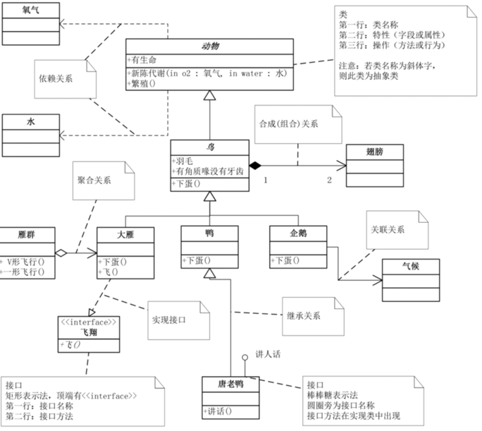
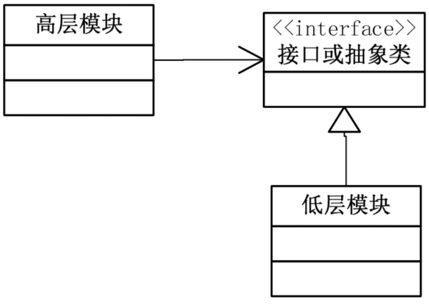
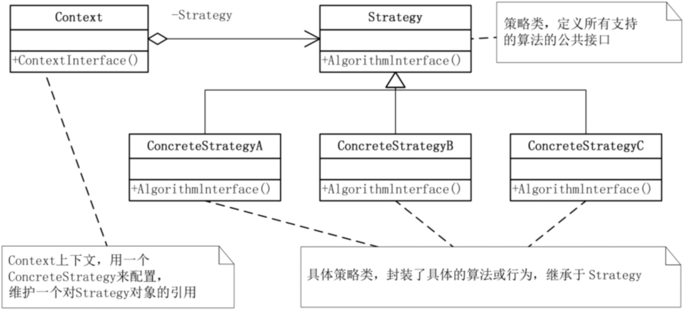
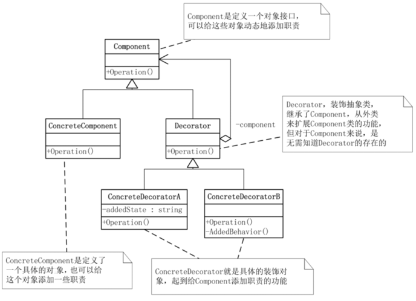
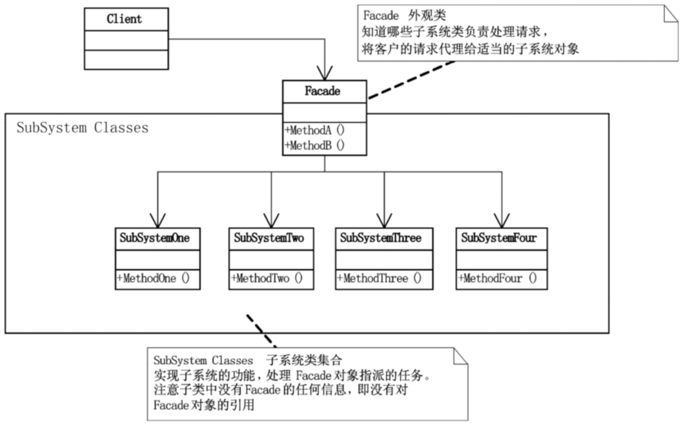
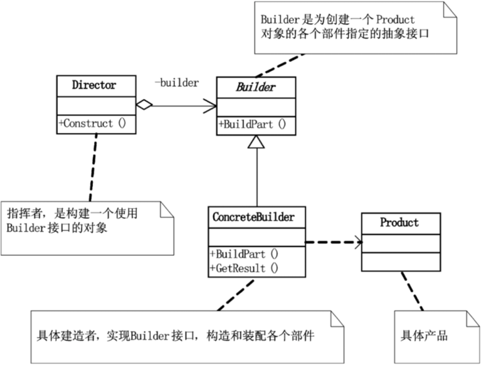

## 设计模式 KT

## UML图



## 一、设计原则

### 1.单一职责

>
如果一个类承担的职责过多，就等于把这些职责耦合在一起，一个职责的变化可能会削弱或者抑制这个类完成其他职责的能力。这种耦合会导致脆弱的设计，当变化发生时，设计会遭受到意想不到的破坏[ASD]

    软件设计真正要做的许多内容，就是发现职责并把那些职责相互分离[ASD]。其实要去判断是否应该分离出类来，也不难，那就是如果你能够想到多于一个的动机去改变一个类，那么这个类就具有多于一个的职责[ASD]，就应该考虑类的职责分离。

### 2.开放-封闭

    特征：开放扩展，封闭更改

### 3.依赖倒置

    细节依赖于抽象、抽象不依赖于细节;
                                     -> 面向接口编程
    高层不依赖于底层、都应依赖于抽象；



### 4.里氏替换

    子类必须能随时替换父类

### 迪米特法则

    两个类如果不彼此直接通信，那就不应当发生直接的相互作用，在需要调用彼此的成员时，通过第三方中转调用。
    强调松耦合，利复用。

## 二、设计模式

### [简单工厂模式 -->](src/main/kotlin/SimpleFactory.kt)

    代码无错就是优
    解决对象创建问题

### [策略模式 -->](src/main/kotlin/StrategyPattern.kt)

    封装算法家族，使相互之间方便替换、算法变化不会影响到使用者



### [装饰模式 -->](src/main/kotlin/Decorator.kt)

    为已有功能动态地添加更多功能的一种方式
    动态地给一个对象添加一些额外的职责，就增加功能来说，装饰模式比生成子类更为灵活。



### [代理模式](src/main/kotlin/Proxy.kt)

    远程代理、虚拟代理、保护代理
    隐藏真是的操作细节

### [工厂方法模式](src/main/kotlin/FactoryMethod.kt)

    相对于简单工厂模式，既没有违背 开放-封闭原则，又保持了封装对象创建的过程
    缺点：代码量会增加，增加工厂类数量，增加工厂类维护成本

### 原型模式

    没啥说的。。Java直接调用接口 ICloneable

### 模板模式

    定义一个操作中的算法的骨架，而将一些步骤延迟到子类中
    就是复用上升，弄成继承。

### 门面模式

    
    为子系统的一组接口提供统一的调用。
    需要有意识的将不同的逻辑按层分开：0. 视图层 1.业务逻辑层 2.数据层 3.数据处理层
    后续随着重构演化以及内容复杂进行细分：1.数据访问层 2.数据处理层 3.数据存储层
>   该模式往往对重构&开发新需求时很有帮助，为新系统开发一个外观Facade类，来提供设计粗糙或高度复杂的遗留代码的比较清晰简单的接口，让新系统与Facade对象交互，Facade与遗留代码交互所有复杂的工作。[R2P]


### 建造者模式


    🔥现实实际中的建造者模式，一般都是比较喜欢链式调用
```java
public class BuilderDemo {
    public static void main(String[] args) {
        String text = new Builder().setA("a").setB("b").setC("c").build();
    }
}
```

    